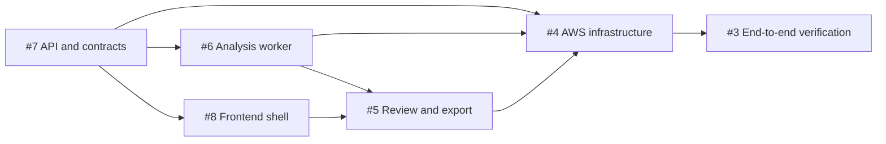

# Implementation roadmap

This roadmap defines the dependency order for the six approved implementation
milestones. GitHub issue numbers reflect creation order, not implementation
order.

## Sequence

| Order | Milestone | Entry criteria | Completion gate |
| --- | --- | --- | --- |
| 1 | [#7 Control-plane API and job contracts](https://github.com/AlkaSaliss/redact-all-the-things/issues/7) | Repository governance bootstrap complete | Job, status, manifest, ownership, expiry, persistence, and worker-submission contracts pass local tests |
| 2 | [#6 PDF and image analysis worker](https://github.com/AlkaSaliss/redact-all-the-things/issues/6) | #7 contracts merged | Validation, rasterization, OCR, PII mapping, normalized regions, checkpoints, and synthetic regression tests pass |
| 3 | [#8 React frontend and authentication shell](https://github.com/AlkaSaliss/redact-all-the-things/issues/8) | #7 contracts merged; representative job and manifest fixtures available | Authentication boundary, upload flow, job dashboard, routing, API client, and UI tests pass |
| 4 | [#5 Review editor and rasterized export](https://github.com/AlkaSaliss/redact-all-the-things/issues/5) | #6 and #8 merged | Editor persistence and geometry tests pass; raster-only PDF and metadata-stripped image security tests pass |
| 5 | [#4 AWS infrastructure](https://github.com/AlkaSaliss/redact-all-the-things/issues/4) | #7, #6, #8, and #5 pass local integration tests | AWS resources, deployment workflows, security controls, lifecycle rules, and cost controls are validated |
| 6 | [#3 End-to-end verification](https://github.com/AlkaSaliss/redact-all-the-things/issues/3) | #4 deployment complete | Every technical-scope acceptance criterion passes in the deployed system |

## Dependency flow

## Delivery policy

- For solo development, keep one implementation milestone in progress.
- Move only the next dependency-satisfied milestone to `Ready`; keep later
  milestones in `Backlog`.
- After #7 is complete, #6 and #8 may proceed in parallel only when separate
  contributors are available. For solo development, complete #6 first because
  OCR quality, mapping, memory, model packaging, and cost are the highest-risk
  assumptions.
- Security, privacy, cost, documentation, and tests are continuous
  requirements. Issue #3 performs final system verification; it does not defer
  those concerns from earlier milestones.
- Each milestone uses its own GitHub Issue, OpenSpec change, branch, pull
  request, tests, documentation updates, required ADRs, and Graphify refresh.

## Contract ownership

Issue #7 owns the initial shared data and lifecycle contracts. Later milestones
must consume those contracts. Any later contract change requires an explicit
OpenSpec update, compatibility analysis, and coordinated updates to affected
producers and consumers.

Local development uses mocked AWS clients and containers through issue #5.
Production AWS deployment begins only in issue #4 after application behavior
passes local integration tests.
